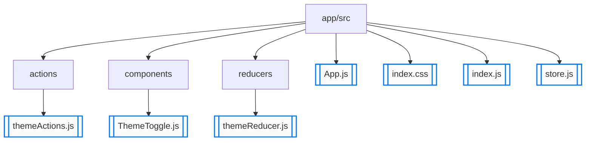

# Урок 5. 

## Компоненты высшего порядка знакомство с Redux

Приложение для переключения темы сайта
Создать приложение, позволяющее пользователю переключать между светлой и темной темой сайта.

Функционал:

- Action types: TOGGLE_THEME.
- Actions: Создайте действие для переключения темы.
- Reducer: Реализуйте редьюсер, который обрабатывает это действие и изменяет тему в состоянии приложения.
- Component: Создайте компонент, который отображает переключатель для изменения темы сайта.

Описание:

- Состояние: Для хранения текущей темы можно использовать логическую переменную (true для темной темы и false для светлой) или строку ("dark" или "light").

- Интерфейс: Ваш интерфейс может состоять из переключателя, который изменяет тему с светлой на темную и обратно.

## Решение

app/src
├── actions
│   └── [themeActions.js](./app/src/actions/themeActions.js)
├── components
│   └── [ThemeToggle.js](./app/src/components/ThemeToggle.js)
├── reducers
│   └── [themeReducer.js](./app/src/reducers/themeReducer.js)
├── [App.js](./app/src/App.js)
├── [index.css](./app/src/index.css)
├── [index.js](./app/src/index.js)
└── [store.js](./app/src/store.js)

