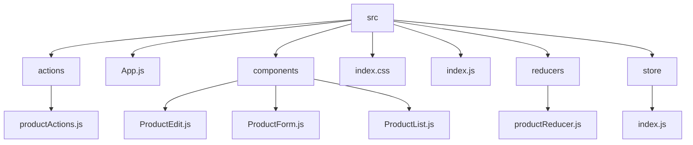

# Урок 6

## Погружение в Redux. Connect

Разработать приложение для управления каталогом продуктов, позволяющее добавлять, удалять, отображать и редактировать продукты.

Настройка Redux Store:

- Используйте configureStore из @reduxjs/toolkit для создания хранилища.
- Определите начальное состояние и создайте слайс с использованием createSlice для продуктов. Каждый продукт должен иметь id, name, description, price, и available.
- В слайсе определите редьюсеры и действия для добавления нового продукта, удаления продукта по ID, обновления продукта и изменения его доступности.

Компоненты React:

Компонент для добавления продукта:

- Создайте форму, позволяющую пользователям вводить данные нового продукта (имя, описание, цена, доступность) и добавлять его в каталог.

Компонент для отображения продуктов:

- Разработайте компонент, который отображает список всех продуктов с их атрибутами, а также кнопки для удаления продукта из каталога и переключения его доступности.

Компонент для редактирования продукта:

- предоставьте возможность редактирования существующих продуктов, чтобы можно было изменять их имя, описание, цену и доступность.

## Решение

