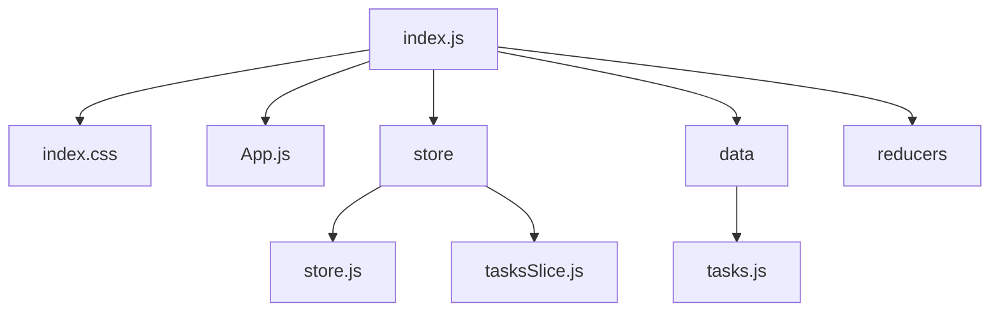

# Урок 7

## Redux middlewares. Redux persist

Имитация асинхронной загрузки и отображения списка задач из локального хранилища.

1. Инициализация проекта и установка зависимостей: Инициализируйте новый проект React . Установите @reduxjs/toolkit и react-redux.

2. Создание локальных данных: Определите массив объектов, представляющих задачи, в файле, например, src/data/tasks.js. Каждая задача может содержать поля, такие как id, title и completed.

3. Настройка Redux store: Создайте Redux store с использованием configureStore из @reduxjs/toolkit. Используйте Redux Thunk middleware, уже включённый в @reduxjs/toolkit.

4. Создание асинхронного действия с использованием Thunk: Используйте createAsyncThunk для создания асинхронного действия, которое "загружает" данные задач из локального файла. Хотя данные и локальные, имитируйте асинхронное поведение, например, с использованием setTimeout.

5. Работа с компонентом: Используйте хуки useDispatch и useSelector в компоненте для диспетчеризации асинхронного действия и выборки списка задач из состояния. Выведите список задач.

## Решение

